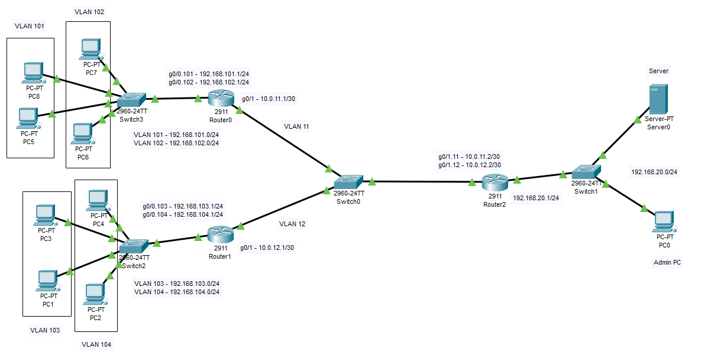

# Безопасность вычислительных сетей. Лабораторная работа №2

## VLAN, ACL, NAT

На изображении представлена топология сети.

Необходимо воспроизвести данную топологию.

Необходимо настроить VLAN согласно схеме с рисунка: по 2 VLAN в сети каждого
маршрутизатора, и также 2 VLAN в сети между маршрутизаторами. После настройки VLAN,
необходимо настроить протокол динамической маршрутизации, используете свой протокол
из первой работы, после этого необходимо проверить доступность всех хостов.

Необходимо настроить ACL таким образом, чтобы у устройств `PC1` и `PC3` был доступ
до `Server0`, а у `PC2` и `PC4` не был.

Необходимо настроить динамический NAT для маршрутизаторов `Router0` и `Router1`
таким образом, чтобы внутренние адреса устройств заменялись на внешний адрес
маршрутизатора.

Необходимо предоставить удаленный доступ по *ssh* с компьютера администратора до
маршрутизаторов `Router0` и `Router1`, всем остальным такой доступ запретить.
